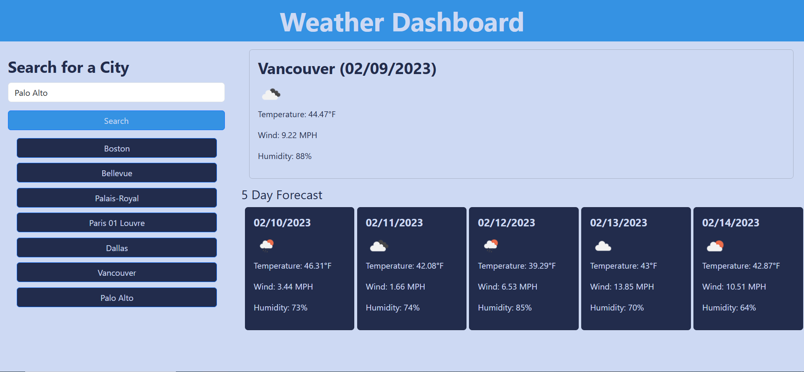

# Weather Dashboard

## Description

This website allows you to search for the current weather and 5-day weather forecast of a city.

## Usage

Type in a city into the search bar and click on the search button to receive information regarding the current weather and the weather forecast for the next 5 days. Information provided includes temperature, wind speed, and humdity. The names of the cities searched are listed underneath the search button as the search history so the user can re-check the forecast of their previous searches.

## Link to deployed Application
https://etfruitninja.github.io/weather-dashboard/

## Screenshot

## Credits

The creation of this website was guided by the UW Coding Bootcamp.